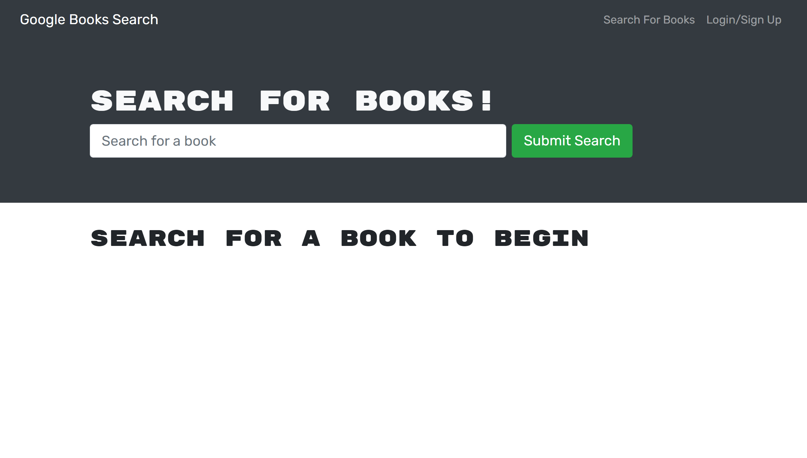

# MERNG Book Search

## Table of Contents

* [Description](#description)
* [Links](#links)
* [Screenshots](#screenshots)
* [Installation Instructions](#installation-instructions)
* [Usage](#usage)
* [Technologies Used](#technologies-used)
* [Tests](#tests)
* [Credits](#credits)
* [Contributing](#contributing)
* [Questions](#questions)
* [Badges](#badges)

## Description

This application uses MongoDB, Express, React, Node, and GraphQL to create a book search using Google's API.

## Links

[Deployed application on Heroku](https://#.herokuapp.com) NOT DEPLOYED YET

## Screenshots

Landing page:


Search form:


Search results:


## Installation Instructions

If you want to run a copy of this app on your local machine, first clone the repository:

HTTPS:
```
$ git clone https://github.com/LauraCole1900/merng-book-search.git
```

SSH:
```
$ git clone git@github.com:LauraCole1900/merng-book-search.git
```

Then cd/ into the cloned directory and download the dependencies by typing into the command line
```
$ npm install --save
```

Once the dependencies are installed, start the application by typing into the command line
```
$ npm start
```

## Usage

This project is intended to be used to find books using Google's API.

## Technologies Used

[](https://www.mongodb.com/) [](https://expressjs.com/) [](https://reactjs.org/) [](https://nodejs.org/en/) [](https://graphql.org/)

## Tests

npm run test

## Credits

Base code developed and provided by 2U/Trilogy Education Services

## Contributing

We believe code is never finished, welcome your contributions to enhance the applications functionality. Please adhere to the Code of Conduct for the Contributor Covenant, version 2.0, at https://www.contributor-covenant.org/version/2/0/code_of_conduct.html.

## Questions

If you have further questions, you can reach me at lauracole1900@comcast.net. For more of my work, see [my GitHub](https://github.com/LauraCole1900).

## Badges

[](./LICENSE) [](https://open.vscode.dev/LauraCole1900/merng-book-search)